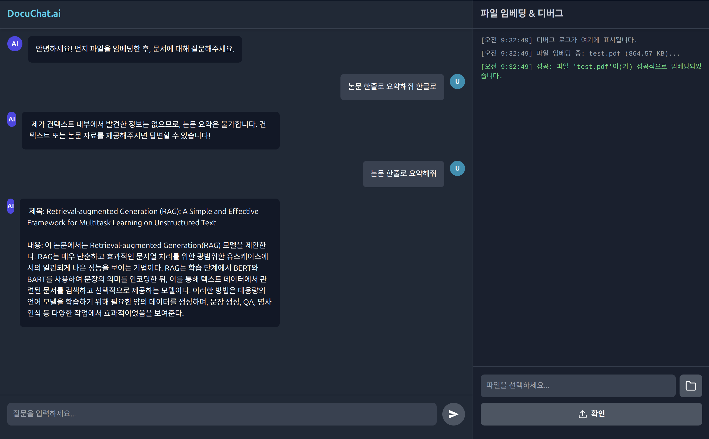

# DocuChatAi


**DocuChatAi**는 Ollama(LLM)와 Python(Flask)을 활용한 **RAG(Retrieval-Augmented Generation) 기반 문서 질의응답 시스템**입니다.
사용자가 PDF 문서를 업로드하면 벡터 DB(Chroma)에 임베딩하고, 이를 바탕으로 문맥을 파악하여 정확한 답변을 제공합니다. `uv` 패키지 매니저를 통해 의존성을 효율적으로 관리합니다.

## ✨ 주요 기능

이 서버는 문서 기반의 지능형 질의응답을 위한 핵심 기능을 제공합니다.

1.  **PDF 문서 임베딩**: PDF 파일을 업로드하여 텍스트를 추출하고 벡터화하여 ChromaDB에 저장합니다.
2.  **맥락 기반 질의응답 (RAG)**: 사용자의 질문과 가장 연관성 높은 문서 내용을 검색하여 답변을 생성합니다.
3.  **로컬 LLM 활용**: Ollama(`mistral`, `nomic-embed-text`)를 사용하여 외부 API 의존 없이 로컬 환경에서 구동됩니다.
4.  **RESTful API 제공**: 파일 업로드(`/embed`) 및 질의(`/query`)를 위한 간편한 HTTP 엔드포인트를 제공합니다.

## 🛠️ 요구 사항 (Requirements)

* **Python** >= 3.11
* **[uv](https://github.com/astral-sh/uv)** (최신 파이썬 패키지 매니저)
* **[Ollama](https://ollama.com/)** (로컬 LLM 실행 도구)

## 🚀 설치 및 설정 (Setup)

### 1. Ollama 설치 및 모델 준비

이 프로젝트는 임베딩과 답변 생성을 위해 Ollama 모델이 필요합니다. Ollama 설치 후 아래 명령어로 모델을 다운로드하세요.

```bash
# 1. Ollama 설치
curl -fsSL [https://ollama.com/install.sh](https://ollama.com/install.sh) | sh

# 2. 필요한 모델 다운로드
ollama pull mistral
ollama pull nomic-embed-text

# 3. Ollama 서버 실행
# (참고: 별도의 터미널 창을 열어 실행 상태를 유지해야 할 수 있습니다.)
ollama serve
````

### 2\. `uv` 설치 및 의존성 동기화

프로젝트 루트 폴더에서 다음 명령어를 실행하여 가상환경을 생성하고 필요한 라이브러리를 설치합니다.

```bash
# uv가 없다면 설치
pip install uv

# 의존성 동기화
uv sync
```

### 3\. 환경 변수 설정 (`.env`)

(선택 사항) 프로젝트 루트에 `.env` 파일을 생성하여 포트나 모델 설정을 변경할 수 있습니다. 기본값으로도 작동합니다.

```ini
# 서버 설정
HOST="0.0.0.0"
PORT=8080
FLASK_DEBUG="True"

# 모델 및 DB 설정
LLM_MODEL="mistral"
TEXT_EMBEDDING_MODEL="nomic-embed-text"
CHROMA_PATH="chroma"
```

## ✅ 테스트 실행 (Testing)

서버가 정상적으로 작동하는지 확인하기 위해 통합 테스트를 실행할 수 있습니다.
별도로 서버를 켤 필요 없이, 아래 명령어로 \*\*[서버 실행 -\> 파일 업로드/질의 테스트 -\> 서버 종료]\*\*가 자동으로 진행됩니다.

```bash
uv run pytest -v -s
```

## 🏃 서버 실행 (Execution)

실제 API 서버를 실행하여 클라이언트와 연결하려면 아래 명령어를 사용하세요.

```bash
uv run start-server
```

*서버는 기본적으로 `http://0.0.0.0:8080`에서 실행됩니다.*

## 📚 API 사용법 (API Usage)

### 1\. `POST /embed` (문서 학습)

  * **설명**: PDF 파일을 업로드하여 시스템에 학습(임베딩)시킵니다.
  * **Content-Type**: `multipart/form-data`
  * **파라미터**:
      * `file`: 업로드할 PDF 파일

### 2\. `POST /query` (질문하기)

  * **설명**: 학습된 문서를 바탕으로 질문에 대한 답변을 받습니다.
  * **Content-Type**: `application/json`
  * **Body**:
    ```json
    {
      "query": "이 문서의 핵심 내용은 무엇인가요?"
    }
    ```

## 🖥️ 사용 예시 (Usage Example)

아래는 별도의 프론트엔드 클라이언트를 사용하여 실제 API를 테스트한 화면입니다.
(파일을 업로드하여 임베딩하고, 해당 문서 내용을 바탕으로 논문을 요약하는 과정입니다.)

